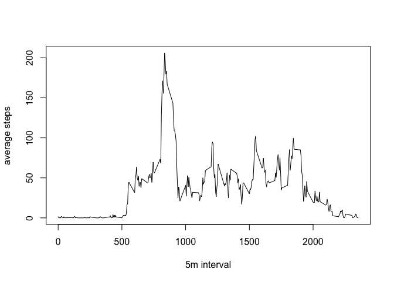
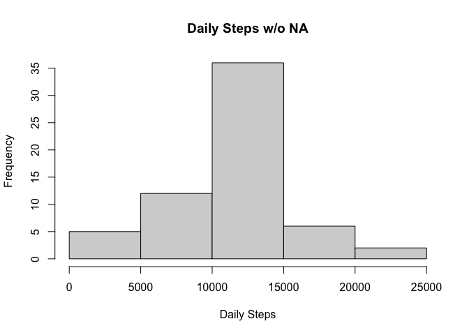

## Loading and preprocessing the data

```r
setwd("/Users/asset/Documents/data/R text/RepData_PeerAssessment1")
unzip("activity.zip")
data <- read.csv(file = "activity.csv")
head(data)
```

```
##   steps       date interval
## 1    NA 2012-10-01        0
## 2    NA 2012-10-01        5
## 3    NA 2012-10-01       10
## 4    NA 2012-10-01       15
## 5    NA 2012-10-01       20
## 6    NA 2012-10-01       25
```

```r
names(data)
```

```
## [1] "steps"    "date"     "interval"
```

## What is mean total number of steps taken per day?

```r
dailysteps<-aggregate(steps~date, data, sum, na.rm=TRUE)
hist(dailysteps$steps, main = "Daily Steps", xlab = "Daily Steps")
```

<!-- -->

```r
mean(dailysteps$steps)
```

```
## [1] 10766.19
```

```r
median(dailysteps$steps)
```

```
## [1] 10765
```

## What is the average daily activity pattern?

```r
steps5m<-aggregate(steps~interval, data=data, mean, na.rm=TRUE)
plot(steps~interval, data=steps5m, type="l", xlab = "5m interval", ylab = "average steps")
```

<!-- -->

```r
steps5m[which.max(steps5m$steps),]$interval
```

```
## [1] 835
```

## Imputing missing values

```r
totalNA<-sum(is.na(data$steps))
print(totalNA)
```

```
## [1] 2304
```

```r
mean5m<-function(interval){
    steps5m[steps5m$interval==interval,]$steps
}
dataNA<-data
for(i in 1:nrow(dataNA)){
    if(is.na(dataNA[i,]$steps)){
        dataNA[i,]$steps<-mean5m(dataNA[i,]$interval)
    }
}
dailystepsNA<-aggregate(steps~date, data=dataNA, sum)
hist(dailystepsNA$steps, main = "Daily Steps w/o NA", xlab = "Daily Steps")
```

<!-- -->

```r
mean(dailystepsNA$steps)
```

```
## [1] 10766.19
```

```r
median(dailystepsNA$steps)
```

```
## [1] 10766.19
```

```r
meanD<-mean(dailysteps$steps)/mean(dailystepsNA$steps)
medianD<-median(dailysteps$steps)/median(dailystepsNA$steps)
print(paste("Difference between mean steps in the datas with and without NA - ", round(meanD), "%"))
```

```
## [1] "Difference between mean steps in the datas with and without NA -  1 %"
```

```r
print(paste("Difference between median steps in the datas with and without NA -", round(medianD), "%"))
```

```
## [1] "Difference between median steps in the datas with and without NA - 1 %"
```

## Are there differences in activity patterns between weekdays and weekends?

```r
dataNA$date<-as.Date(strptime(dataNA$date, format="%Y-%m-%d"))
dataNA$day<-weekdays(dataNA$date)
for (i in 1:nrow(dataNA)) {
    if (dataNA[i,]$day %in% c("Saturday","Sunday")) {
        dataNA[i,]$day<-"weekend"
    }
    else{
        dataNA[i,]$day<-"weekday"
    }
}
dailystepsW<-aggregate(dataNA$steps~dataNA$interval + dataNA$day, dataNA, mean)
names(dailystepsW)
```

```
## [1] "dataNA$interval" "dataNA$day"      "dataNA$steps"
```

```r
names(dailystepsW) <- c("interval", "day", "steps")
library(lattice)
xyplot(steps ~ interval | day, dailystepsW, type = "l", layout = c(1, 2), 
    xlab = "5m interval", ylab = "number of steps")
```

<!-- -->
